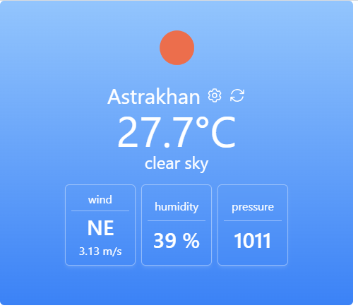

# weather-app

Виджет для отображения информации о погоде в выбранном регионе.

Для использования виджета достаточно скопировать приведенный блок кода на HTML-страницу.
```
<weather-widget/>
<script src="http://cdn.jsdelivr.net/gh/dzyabenkoea/weather-widget/dist/weather-widget.umd.min.js"/>
```

## Главный экран



## Настройка городов


### Добавление города


Поднимем добавленный город вверх, чтобы отобразить погоду в нем:


## Вывод ошибок

### Ошибка получения данных


### Не указан API-ключ


---

## Project setup
```
yarn install
```

### Compiles and hot-reloads for development
```
yarn serve
```

### Compiles and minifies for production
```
yarn build
```

### Lints and fixes files
```
yarn lint
```

### Customize configuration
See [Configuration Reference](https://cli.vuejs.org/config/).
